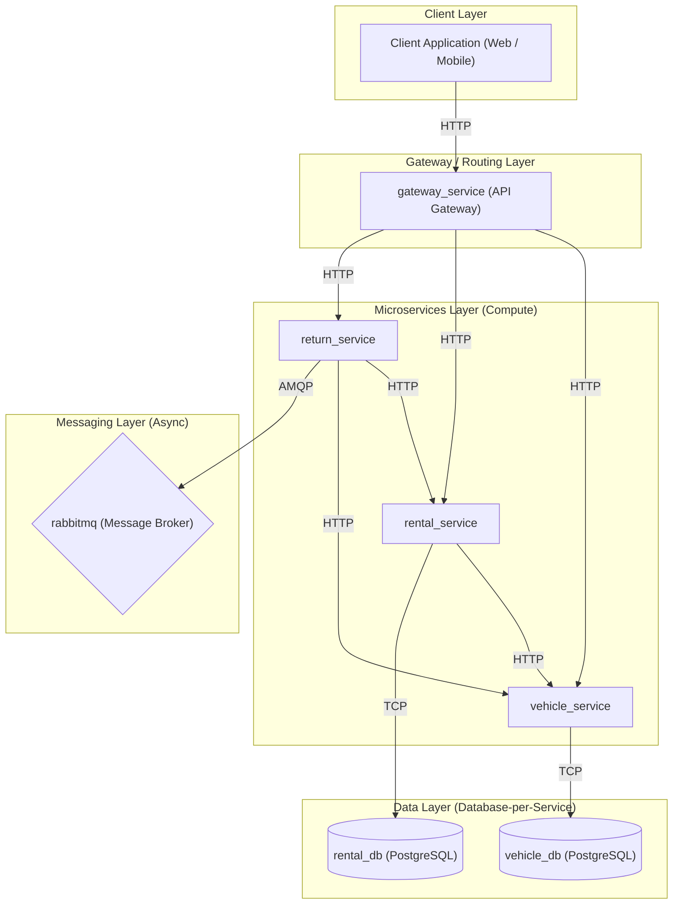
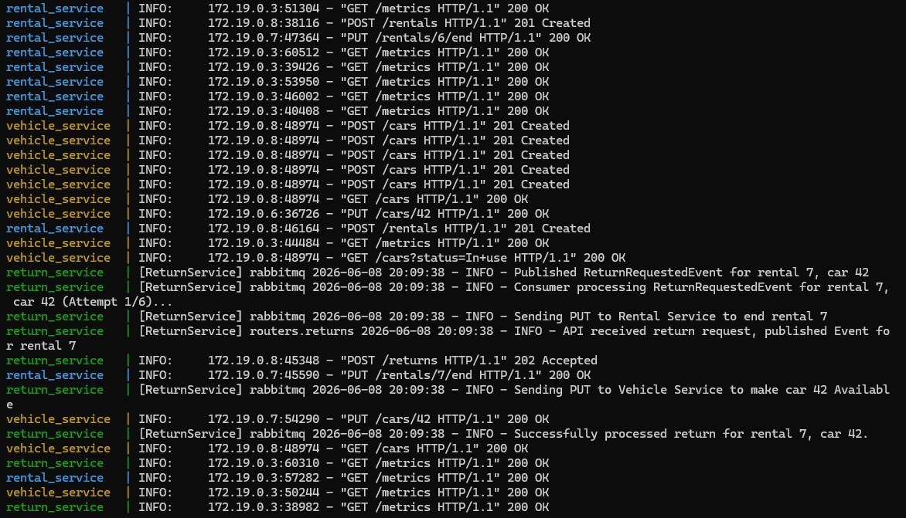
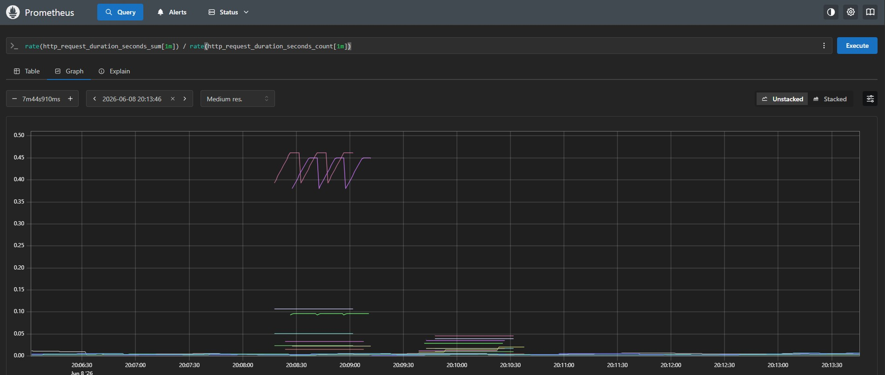

# DriveNow - Microservices Architecture

Welcome to the DriveNow internal vehicle management system. This system is built on a modern, scalable, event-driven microservices architecture.

## A Brief Architecture Description

The system employs a **Monorepo** approach, housing all independent microservices in a single repository for easier orchestration while maintaining strict isolation. Key architectural decisions include:
* **Single Entry Point (API Gateway)**: All client traffic goes through a central, stateless API Gateway (`gateway_service`), which proxies requests to internal microservices.
* **Database Isolation**: We use a unified PostgreSQL instance, but enforce strict database isolation (`vehicle_db`, `rental_db`). PostgreSQL was chosen over NoSQL options because of its strong ACID compliance—critical for ensuring transactional integrity in rental operations—and its robust relational structure. Services only interact with their own dedicated database to prevent tight coupling.
* **Synchronous vs. Asynchronous Workflows**: Core transactional paths (like initiating an immediate rental) use Synchronous HTTP REST calls to ensure atomicity. Side-effects and background tasks (like returning a car) use Asynchronous Event-Driven messaging via RabbitMQ to decouple services and handle high throughput.

## Graphic Flow of Your Design Architecture



## How to Run the Project

Because this is a microservices architecture that relies on databases and message brokers, it must be orchestrated using Docker Compose. Ensure Docker is installed and running on your machine.

**1. Run the server:**
```bash
docker-compose -f infrastructure/deployment/docker-compose.yml up -d --build
```

This single command will automatically spin up all infrastructure (PostgreSQL, RabbitMQ, Prometheus) and the internal microservices (Gateway, Vehicle, Rental, Return). 

**2. Run the small example (End-to-End Demo):**
```bash
uv run --project src/cli src/cli/small_example.py
``` 

## How to Use the API

The project provides an HTTP REST API exposed via the API Gateway on port `8000`. This REST API serves as the primary interface for external clients, utilizing standard HTTP verbs (GET, POST, PUT, DELETE) and accepting/returning JSON payloads. All traffic is routed safely through the Gateway.

The primary endpoints are:
* **Vehicles**: `POST /cars`, `GET /cars` - Managed by the Vehicle Service.
* **Rentals**: `POST /rentals` - Managed by the Rental Service.
* **Returns**: `POST /returns` - Managed by the Return Service.

## How to Use the CLI

The project includes a built-in Command Line Interface (CLI) designed for developers and operators. 
**Important:** The CLI does not bypass the system's architecture to directly access databases or internal microservices. Instead, it acts as a user-friendly client wrapper that automatically constructs and sends standard HTTP requests to the API Gateway, exactly replacing the need to manually write complex `curl` requests or build a graphical User Interface (UI) for basic operations.

**Note for CLI users**: Make sure to run the CLI commands from the root directory of the project.

## Example Usage

Below are concrete examples of how to interact with the core flows of the system using both the HTTP API (`curl`) and the built-in Command Line Interface (CLI).

### 1. Adding a Car

**Using `curl`:**
```bash
curl -X POST "http://localhost:8000/cars" \
     -H "Content-Type: application/json" \
     -d '{
           "model": "Toyota Camry",
           "year": 2024,
           "status": "Available"
         }'
```

**Using the CLI:**
```bash
uv run --project src/cli src/cli/main.py cars add --model "Toyota Camry" --year 2024
```

### 2. Initiating a Rental

**Using `curl`:**
```bash
curl -X POST "http://localhost:8000/rentals" \
     -H "Content-Type: application/json" \
     -d '{
           "car_id": 1,
           "customer_id": 101,
           "customer_name": "John Doe",
           "start_date": "2026-06-08T10:00:00Z",
           "end_date": "2026-06-15T10:00:00Z"
         }'
```

**Using the CLI:**
```bash
uv run --project src/cli src/cli/main.py rentals create --car-id 1 --customer-id 101 --customer-name "John Doe" --start 2026-06-08 --end 2026-06-15
```

### 3. Returning a Car

**Using `curl`:**
```bash
curl -X POST "http://localhost:8000/returns" \
     -H "Content-Type: application/json" \
     -d '{
           "rental_id": 1,
           "car_id": 1
         }'
```

**Using the CLI:**
```bash
uv run --project src/cli src/cli/main.py returns process --rental-id 1 --car-id 1
```

### 4. Running the Full End-to-End Demo

The project also includes an automated Python script that seamlessly runs through the entire core flow (Adding vehicles, listing them, renting, and returning) and prints beautifully formatted output.

**Using the CLI:**
```bash
uv run --project src/cli src/cli/small_example.py
```

### 5. Viewing Live Metrics

You can use the CLI to fetch the exact number of active cars and ongoing rentals directly from Prometheus without leaving the terminal. This command contacts the Prometheus HTTP API and formats the live business metrics into a readable table.

**Using the CLI:**
```bash
uv run --project src/cli src/cli/main.py metrics show
```

---

## Visual Proof of Observability

### The Asynchronous Log Trace



### The Prometheus Dashboard


