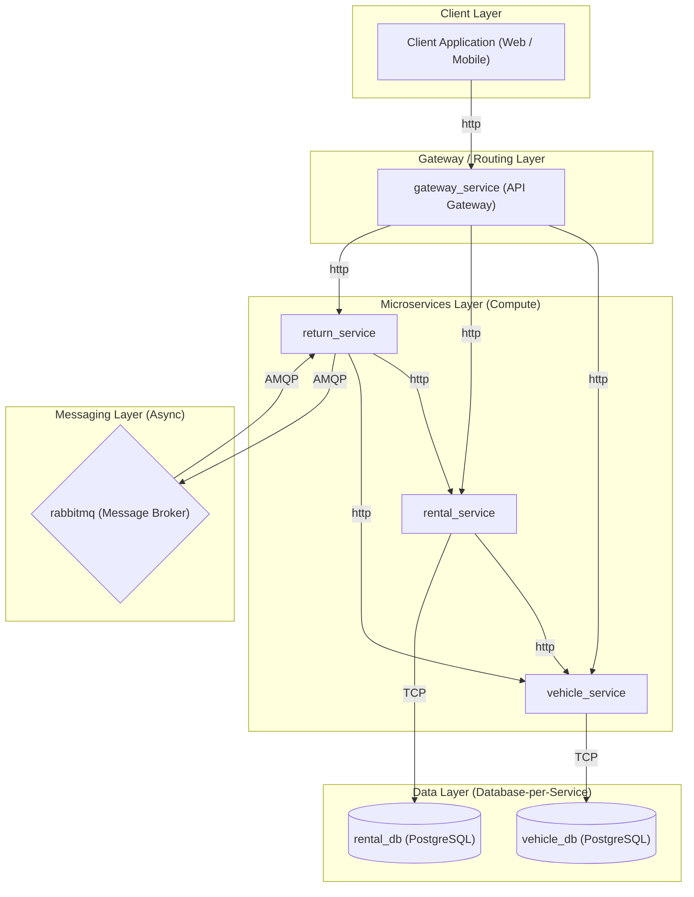

```mermaid
graph TD
    %% Client Layer
    subgraph "Client Layer"
        Client["Client Application (Web / Mobile)"]
    end

    %% Gateway / Routing Layer
    subgraph "Gateway / Routing Layer"
        GatewayService["gateway_service (API Gateway)"]
    end

    %% Microservices Layer
    subgraph "Microservices Layer (Compute)"
        VehicleService["vehicle_service"]
        RentalService["rental_service"]
        ReturnService["return_service"]
    end

    %% Messaging Layer
    subgraph "Messaging Layer (Async)"
        RabbitMQ{"rabbitmq (Message Broker)"}
    end

    %% Data Layer
    subgraph "Data Layer (Database-per-Service)"
        VehicleDB[("vehicle_db (PostgreSQL)")]
        RentalDB[("rental_db (PostgreSQL)")]
    end

    %% Connections & Flows

    %% Client -> Gateway
    Client -- http --> GatewayService

    %% Gateway -> Microservices (Synchronous)
    GatewayService -- http --> VehicleService
    GatewayService -- http --> RentalService
    GatewayService -- http --> ReturnService

    %% Microservice -> Microservice (Synchronous HTTP)
    RentalService -- http --> VehicleService
    ReturnService -- http --> RentalService
    ReturnService -- http --> VehicleService

    %% Microservices <-> Messaging Layer (Asynchronous AMQP)
    ReturnService -- AMQP --> RabbitMQ
    RabbitMQ -- AMQP --> ReturnService
    
    %% Note: Other services may publish to RabbitMQ, 
    %% but return_service is explicitly connected via RABBITMQ_URI

    %% Microservices -> Data Layer
    VehicleService -- TCP --> VehicleDB
    RentalService -- TCP --> RentalDB
```
